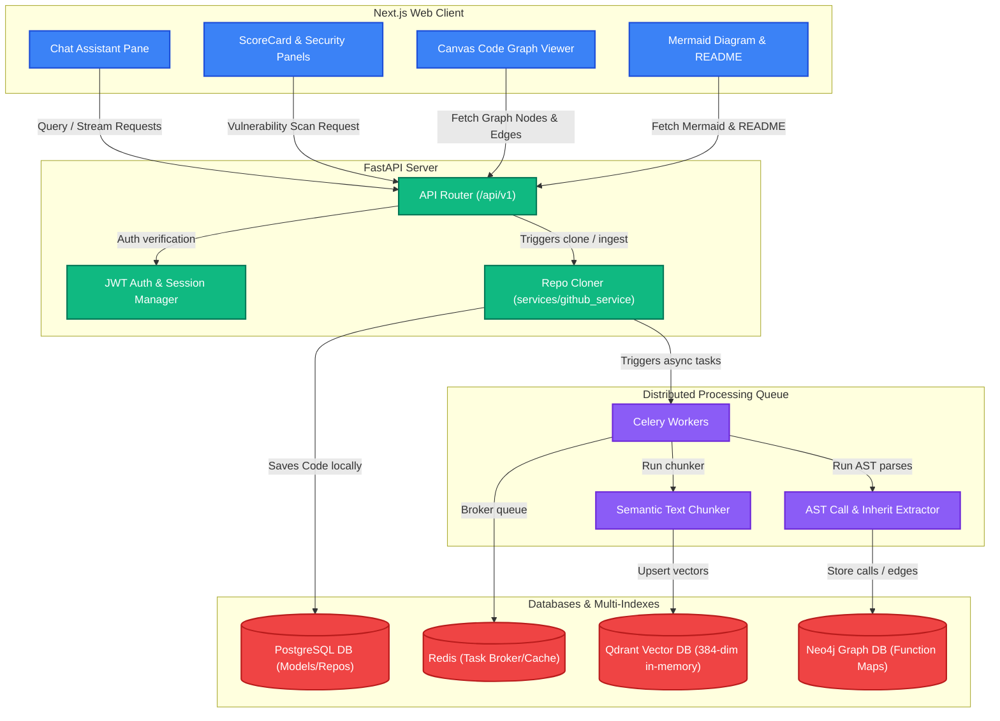

# 🧠 CodeMind AI
> **Agentic Repository Scanner, Interactive Code Graph, and Hybrid GraphRAG Chat Engine**

<p align="center">
  
  
  
  
  
  
</p>

---

## 📖 Table of Contents
1. [Overview & Goal](#-overview--goal)
2. [Architectural Visual Flowchart](#-architectural-visual-flowchart)
3. [Deep Dive: Ingestion & Query Pipelines](#-deep-dive-ingestion--query-pipelines)
4. [Feature Breakdown](#-feature-breakdown)
5. [Repository Structure](#-repository-structure)
6. [Local Setup & Running Guide](#-local-setup--running-guide)

---

## 🎯 Overview & Goal

CodeMind AI is an advanced agentic coding assistant designed to audit, chat with, and visualize repositories of any scale. By combining **Semantic Vector Space Search** (Qdrant) and **Structural Abstract Syntax Tree (AST) Graphs** (Neo4j), it implements a state-of-the-art **GraphRAG** pipeline, letting developers query codebase paths, check security vulnerabilities, trace function dependencies, and download visual architecture maps.

---

## 📊 Architectural Visual Flowchart

Below is the conceptual architecture showing the unified ingestion pipeline and the client interaction layers:



---

## ⚙️ Deep Dive: Ingestion & Query Pipelines

### 1. Ingestion Pipeline
When a repository link is inputted into CodeMind AI, the background worker triggers a multi-phase ingestion process:
```
[GitHub Repo] 
      │
      ▼  (services/github_service/cloner.py)
[Local Temp Directory]
      ├──► [File Walker] ──► [Parsers] ──► [Chunker] ──► [Embedder] ──► [Qdrant DB] (Semantic)
      │
      └──► [AST Builder] ──► [Function Calls / Class Inheritance Extraction] ──► [Neo4j DB] (Structural)
```
*   **Semantic Path:** The parser splits codebase files into overlapping chunks of up to 400 tokens, then embeds them locally using `all-MiniLM-L6-v2` into 384-dimensional vectors stored inside Qdrant.
*   **Structural Path:** The AST module (`builder.py`) traverses python abstract syntax trees (`ast` module) and javascript/typescript source code (via custom bracket-depth regex). It identifies:
    *   **Nodes:** Classes, functions, and class methods.
    *   **Edges:** Caller-callee function call boundaries (`calls` relationships) and base inheritance configurations (`inherits` relationships).

### 2. Neo4j Graph Database & In-Memory Fallbacks
To map code dependencies without throwing execution errors on systems lacking active graph configurations, CodeMind AI runs a multi-tier database storage strategy:
1.  **Neo4j Database (Primary Storage):** Executes Cypher queries over Bolt protocols to persist code nodes and directional relationship edges.
2.  **NetworkX In-Memory (Secondary Fallback):** Automatically registers a local directed graph (`nx.DiGraph()`) using python's NetworkX library if Neo4j parameters are missing or unreachable.
3.  **Raw Dictionary Fallback (Tertiary Fallback):** Maps lists of nodes and edges directly in memory as pure Python lists if third-party libraries are not installed, ensuring the application remains robust.

### 3. Query Pipeline (GraphRAG)
Standard RAG pipelines query vector spaces for semantic similarity but fail to trace topological call stacks (e.g., *"Which functions call write_to_file?"*). CodeMind AI implements **Hybrid GraphRAG**:
```
                        ┌──► Vector Store (Qdrant) ──► Semantic Matches
[User Question] ──► Hybrid Retriever
                        └──► Graph Database (Neo4j) ──► AST Traversal (2-Hops BFS)
                                                                 │
                                                                 ▼
                                                  Combined Context ──► LLM ──► Response
```
When a question is queried:
1.  **Identifiers Extract:** Naive text scanning parses the query to find potential class or function names (such as camelCase or snake_case tokens).
2.  **Vector Retrieval:** Qdrant returns top semantic code blocks matching the vector embedding of the question.
3.  **Graph Expansion:** The system queries Neo4j or the NetworkX fallback for the extracted class/function identifiers, executing a Breadth-First Search (BFS) up to **2 hops** deep to fetch related nodes (callers, callees, and parent classes).
4.  **Composite Prompt Context:** Both semantic vectors and call graphs are compiled into standard instructions and sent to the LLM, giving it full structural awareness of repository layouts.

---

## 🚀 Feature Breakdown

### 1. RAG Chat with Inline Citations
- Dynamic semantic searches utilizing local vector spaces.
- Clear citations showing files and exact lines e.g. `[auth.py:12-45]`.
- Asynchronous Streaming Response (Server-Sent Events) for fast chatbot responses.

### 2. Security & Code Quality Scanner
- **Security Scans:** Integrates Semgrep with custom rules (hardcoded API secrets, use of `eval` or `exec`) and Bandit.
- **Smell Profiler:** Flags functions exceeding 50 lines and finds duplicate text blocks matching >= 6 lines across the directory.
- **Scorer Panel:** Outputs visual ratings from 0 to 100 on Security, Quality, and Maintainability.

### 3. Architecture Flowchart & README Generator
- Analyzes directory structural logs to generate Mermaid.js flowchart mapping components (Frontend to API routers, Database layers, workers).
- Creates structured standard documentation templates dynamically.
- Diagram exporter supporting **SVG** and **PNG** downloads.

### 4. Interactive Canvas Code Graph
- Canvas-based custom graph visualizer rendering classes, methods, and functions.
- Node type color tags (Purple for Classes, Green for Functions, Blue for Methods).
- Node click inspection displaying path details, definition lines, and connection dependencies.

---

## 📁 Repository Structure

```
├── backend/                  # FastAPI REST Server
│   └── app/
│       ├── api/v1/           # Versions 1 routes: auth, repos, analyze, scan, architecture, graph
│       ├── core/             # Base database connections (PostgreSQL) and security configurations
│       └── models/           # SQLAlchemy schema declarations
├── frontend/                 # Next.js Web App
│   ├── app/                  # UI pages and layouts
│   ├── components/           # ScoreCard, SecurityPanel, MermaidViewer, and GraphViewer
│   └── lib/                  # Hooks, query hooks, and global configurations
├── services/
│   ├── ai-service/           # RAG chains, prompts, and Qdrant retrieval routines
│   ├── github_service/       # Cloners, AST generators, stack detection and parser walker
│   └── graph-service/        # Graph builders, retrievers, and traversals
└── workers/                  # Celery tasks (ingest, embedding, graph extraction)
```


## 🔧 Local Setup & Running Guide

### Prerequisites
- **Python 3.10+** (venv initialized)
- **Node.js 18+**
- **PostgreSQL** running on port `5433`
- **Redis** running on port `6379`

### 1. Configuration Setup
Create a `.env` file at the root of the project:
```ini
POSTGRES_USER=codemind
POSTGRES_PASSWORD=codemind123
POSTGRES_DB=codemind_db
POSTGRES_HOST=localhost
POSTGRES_PORT=5433
REDIS_URL=redis://localhost:6379/0
SECRET_KEY=your-super-secret-key-change-in-prod
ALGORITHM=HS256
ACCESS_TOKEN_EXPIRE_MINUTES=30
OPENAI_API_KEY=your-openai-api-key       # Optional: fallback to local template if empty
GEMINI_API_KEY=your-gemini-api-key       # Optional: fallback to local template if empty
NEO4J_URI=bolt://localhost:7687          # Optional: fallback to networkx in-memory if empty
NEO4J_PASSWORD=your-neo4j-password
```

### 2. Run Backend
```bash
cd backend
python -m venv venv
# Windows:
venv\Scripts\activate
# Install deps:
pip install -r requirements.txt
# Launch server:
uvicorn app.main:app --reload
```

### 3. Run Celery Workers
Ensure Redis is running:
```bash
# In active venv:
celery -A workers.ingest_task.celery_app worker --loglevel=info
```

### 4. Run Frontend
```bash
cd frontend
npm install
npm run dev
```
Open [http://localhost:3000](http://localhost:3000) to view the workbench.
