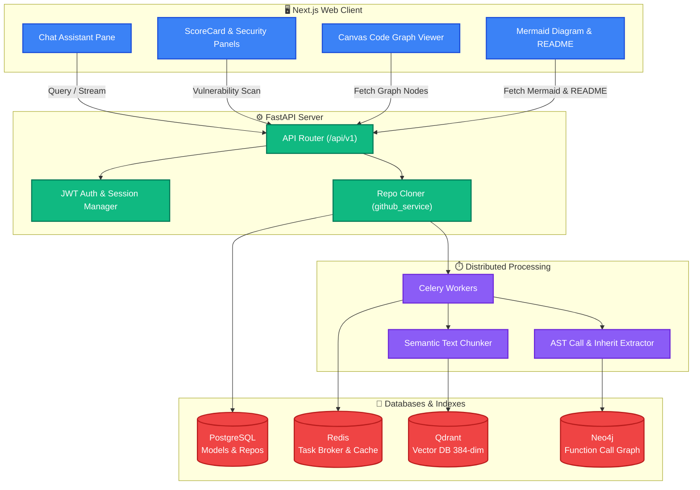

# 🧠 CodeMind AI

> **Agentic Repository Scanner, Interactive Code Graph, and Hybrid GraphRAG Chat Engine**

<p align="center">
  
  
  
  
  
  
</p>

<p align="center">
  <strong>Chat with any codebase. Visualize architecture. Scan for vulnerabilities. All in one place.</strong>
</p>

---

## 📖 Table of Contents

1. [Overview](#-overview)
2. [Architecture](#-architecture)
3. [Ingestion & Query Pipelines](#-ingestion--query-pipelines)
4. [Features](#-features)
5. [Project Structure](#-project-structure)
6. [Getting Started](#-getting-started)
7. [Environment Variables](#-environment-variables)

---

## 🎯 Overview

CodeMind AI is an advanced agentic coding assistant built to audit, chat with, and visualize repositories of any scale. By combining **Semantic Vector Search** (Qdrant) and **Structural AST Graphs** (Neo4j), it implements a state-of-the-art **Hybrid GraphRAG** pipeline — letting developers query codebase paths, trace function dependencies, detect security vulnerabilities, and download visual architecture maps.

| Capability | How It Works |
|---|---|
| **Semantic Chat** | Qdrant vector search over chunked code + LLM response streaming |
| **Graph Traversal** | Neo4j AST graph with 2-hop BFS for caller/callee tracing |
| **Security Scan** | Semgrep + Bandit rules, smell profiler, 0-100 score output |
| **Architecture Diagram** | Auto-generated Mermaid.js flowchart from directory structure |
| **Code Graph Viewer** | Canvas-based interactive node-edge visualizer |

---

## 🏗️ Architecture



---

## ⚙️ Ingestion & Query Pipelines

### Ingestion Pipeline

When a repository URL is submitted, a background worker triggers a multi-phase ingestion process:

```
[GitHub Repo]
      │
      ▼  (services/github_service/cloner.py)
[Local Temp Directory]
      ├──► [File Walker] ──► [Chunker] ──► [Embedder] ──► [Qdrant]   (Semantic)
      └──► [AST Builder] ──► [Call & Inherit Extractor] ──► [Neo4j]  (Structural)
```

**Semantic Path** — Files are split into overlapping chunks of up to 400 tokens, embedded locally using `all-MiniLM-L6-v2` into 384-dimensional vectors, and stored in Qdrant.

**Structural Path** — The AST module traverses Python (`ast` module) and JavaScript/TypeScript (bracket-depth regex) source files to extract:
- **Nodes:** Classes, functions, class methods
- **Edges:** Caller-callee relationships (`calls`) and class inheritance (`inherits`)

### Neo4j Storage Strategy

CodeMind AI uses a 3-tier fallback to ensure the graph layer never crashes:

| Tier | Storage | Condition |
|---|---|---|
| **Primary** | Neo4j (Bolt/Cypher) | Neo4j reachable |
| **Secondary** | NetworkX in-memory (`nx.DiGraph()`) | Neo4j unreachable |
| **Tertiary** | Raw Python dict/list | No third-party libs |

### Hybrid GraphRAG Query Pipeline

Standard RAG pipelines miss topological call stacks. CodeMind AI solves this with **Hybrid GraphRAG**:

```
                   ┌──► Qdrant Vector DB ──► Semantic Matches
[User Question] ──► Hybrid Retriever
                   └──► Neo4j / NetworkX ──► AST BFS (2-Hops)
                                                    │
                                                    ▼
                                     Combined Context ──► LLM ──► Response
```

**Query steps:**
1. **Identifier Extract** — Scans query for camelCase/snake_case function or class names
2. **Vector Retrieval** — Qdrant returns top semantic code blocks
3. **Graph Expansion** — BFS up to 2 hops fetches callers, callees, and parent classes
4. **Composite Prompt** — Both sources merged into one context window sent to LLM

---

## ✨ Features

### 💬 RAG Chat with Inline Citations
- Semantic search over local vector space
- Citations showing exact file + line range (e.g. `[auth.py:12–45]`)
- Server-Sent Events (SSE) for real-time streaming responses

### 🔐 Security & Code Quality Scanner
- **Security:** Semgrep + Bandit rules — detects hardcoded secrets, `eval`/`exec` usage
- **Smell Profiler:** Flags functions over 50 lines, finds duplicate code blocks (≥6 lines)
- **Scorer Panel:** Visual 0–100 ratings for Security, Quality, and Maintainability

### 🗺️ Architecture Diagram Generator
- Mermaid.js flowchart auto-generated from directory structure
- Structured README documentation generated dynamically
- Export to **SVG** and **PNG**

### 🕸️ Interactive Code Graph Viewer
- Canvas-based node-edge visualizer
- Color-coded node types: 🟣 Classes · 🟢 Functions · 🔵 Methods
- Click any node to inspect path, definition line, and dependencies

---

## 📁 Project Structure

```
codemind-ai/
├── backend/
│   └── app/
│       ├── api/v1/          # Routes: auth, repos, analyze, scan, architecture, graph
│       ├── core/            # DB connections (PostgreSQL) + security config
│       └── models/          # SQLAlchemy schema declarations
│
├── frontend/
│   ├── app/                 # Pages and layouts
│   ├── components/          # ScoreCard, SecurityPanel, MermaidViewer, GraphViewer
│   └── lib/                 # Hooks, query hooks, global config
│
├── services/
│   ├── ai-service/          # RAG chains, prompts, Qdrant retrieval
│   ├── github_service/      # Cloners, AST parsers, stack detection, file walker
│   └── graph-service/       # Graph builders, retrievers, BFS traversal
│
└── workers/                 # Celery tasks: ingest, embedding, graph extraction
```

---

## ⚡ Getting Started

### Prerequisites

- Python 3.10+
- Node.js 18+
- PostgreSQL running on port `5433`
- Redis running on port `6379`
- Neo4j (optional — falls back to NetworkX if not available)

### 1. Clone & Install

```bash
git clone https://github.com/Danyal-Nadeem/codemind-ai.git
cd codemind-ai

# Backend
cd backend
python -m venv venv
venv\Scripts\activate        # Windows
pip install -r requirements.txt

# Frontend
cd ../frontend
npm install
```

### 2. Configure Environment Variables

Create a `.env` file at the project root (see [Environment Variables](#-environment-variables) below).

### 3. Run the App

```bash
# Terminal 1 — Backend
cd backend
uvicorn app.main:app --reload

# Terminal 2 — Celery Worker
celery -A workers.ingest_task.celery_app worker --loglevel=info

# Terminal 3 — Frontend
cd frontend
npm run dev
```

Visit `http://localhost:3000`

---

## 🔑 Environment Variables

Create `.env` at the project root:

```ini
# Database
POSTGRES_USER=codemind
POSTGRES_PASSWORD=codemind123
POSTGRES_DB=codemind_db
POSTGRES_HOST=localhost
POSTGRES_PORT=5433

# Redis
REDIS_URL=redis://localhost:6379/0

# Auth
SECRET_KEY=your-super-secret-key-change-in-prod
ALGORITHM=HS256
ACCESS_TOKEN_EXPIRE_MINUTES=30

# AI (optional — falls back to local templates if empty)
OPENAI_API_KEY=your-openai-api-key
GEMINI_API_KEY=your-gemini-api-key

# Graph DB (optional — falls back to NetworkX in-memory if empty)
NEO4J_URI=bolt://localhost:7687
NEO4J_PASSWORD=your-neo4j-password
```

---
